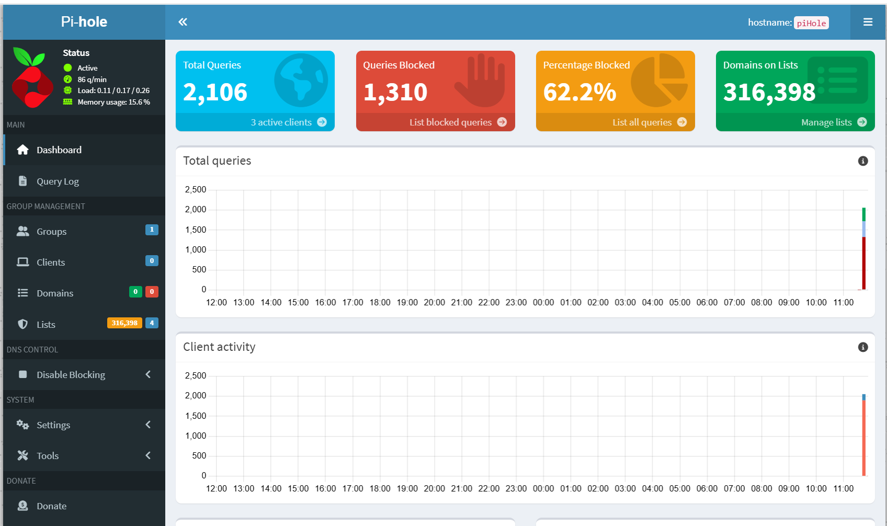
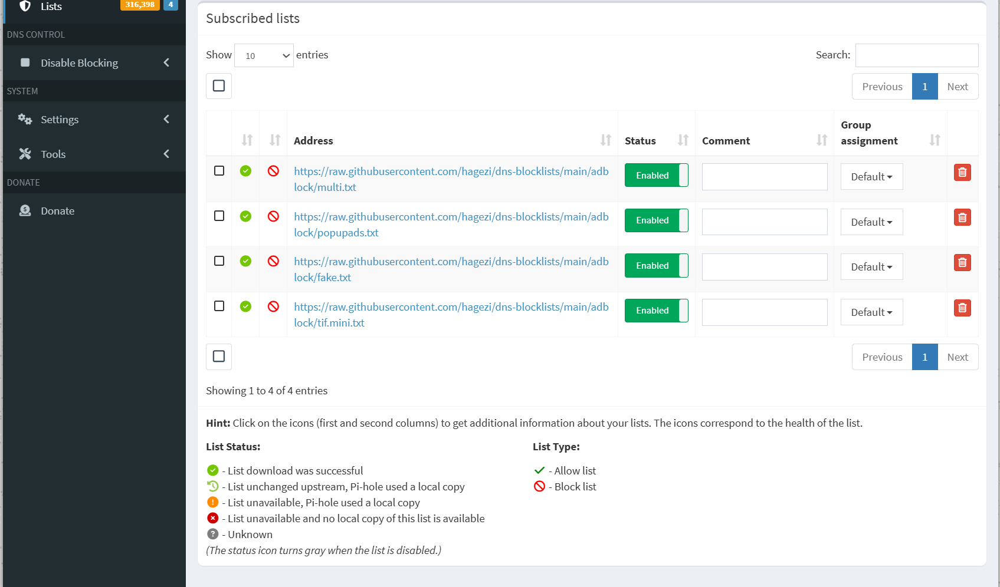
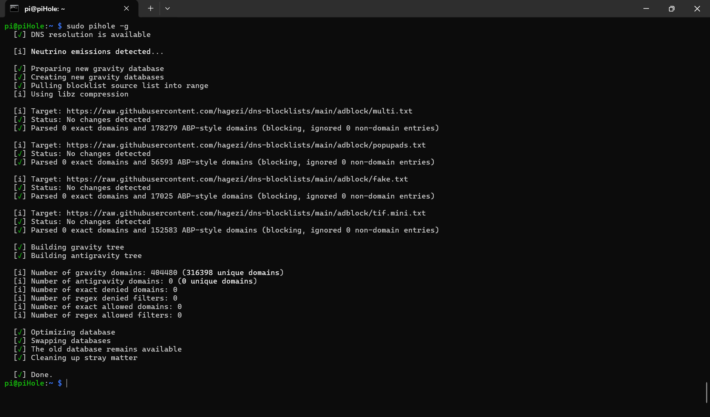
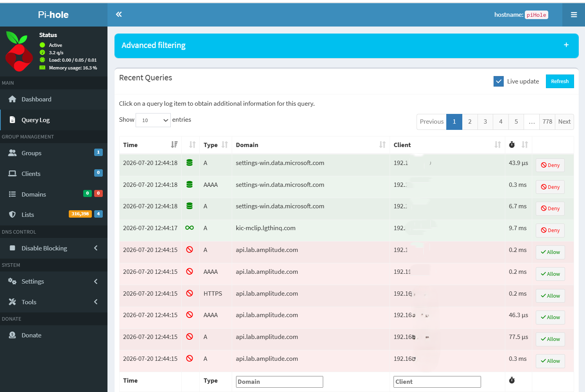

# Screenshots

Drop screenshot files in this folder as you capture them. Suggested filenames referenced by the docs:

| Filename | What to capture | Referenced in |
|---|---|---|
|  | Pi-hole main dashboard (queries, blocked % top clients) | 02-blocklist-strategy.md |
|  | Lists page showing the four HaGeZi lists | 02-blocklist-strategy.md |
|  | Terminal output of `sudo pihole -g` showing ~312k domains | 02-blocklist-strategy.md |
|  | Query Log filtered to blocked entries | 02-blocklist-strategy.md |
|  | Terminal showing successful key-based login | 03-ssh-hardening.md |
|  | Terminal showing `Permission denied (publickey)` on password attempt | 03-ssh-hardening.md |
|  | Output of `sudo fail2ban-client status sshd` | 03-ssh-hardening.md |
|  | Router DHCP page showing Pi's IP as Primary DNS | 04-network-config.md |
|  | Router static IP binding for the Pi's MAC | 04-network-config.md |
|  | `nslookup` showing Pi.hole as server and `0.0.0.0` answer | 04-network-config.md |
|  | H2testw report identifying the counterfeit card | 05-troubleshooting.md |
|  | H2testw report showing a verified authentic card | 05-troubleshooting.md |


Once captured, reference them in the docs like:

```markdown

```

## Redaction

Before committing screenshots, blur or crop any of the following:

- Full router admin URLs beyond `192.168.1.1`
- WiFi SSID names (personal identification)
- Any internal MAC addresses (partially — first 3 octets are vendor OUI and fine; last 3 identify the device)
- Public IPs (WAN address in router pages)
- Full email addresses in Pi-hole admin
- Detailed logs showing external destinations from other household devices
